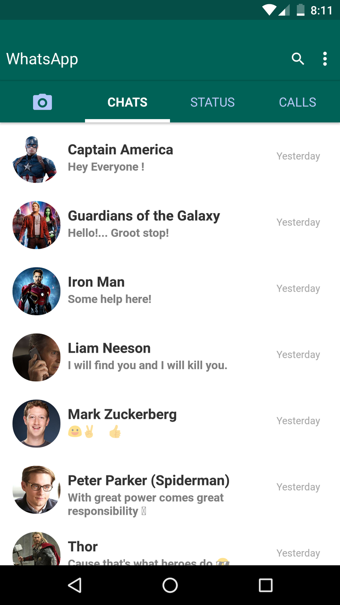

# WhatsApp Clone  

## How to run

``` $ git clone -b whatsappClone https://github.com/HackersYacht/nativebaseExample.git whatsappClone```  
``` $ cd whatsappClone ```    
``` $ npm install ```  
``` $ react-native run-android ```  


### App Screenshot  

