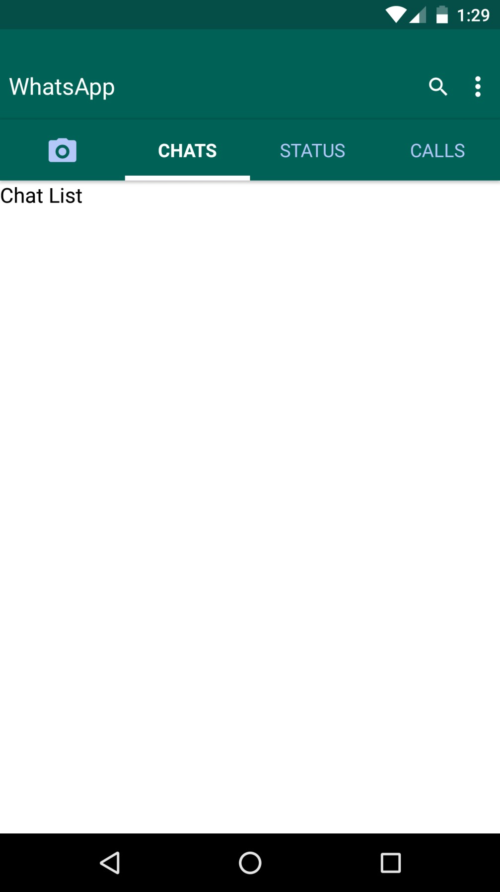

# Native base example  

## How to run

``` $ git clone -b whatsappThemed https://github.com/HackersYacht/nativebaseExample.git whatsappThemed```  
``` $ cd whatsappThemed ```    
``` $ npm install ```  
``` $ react-native run-android ```  


## App Screenshot  

